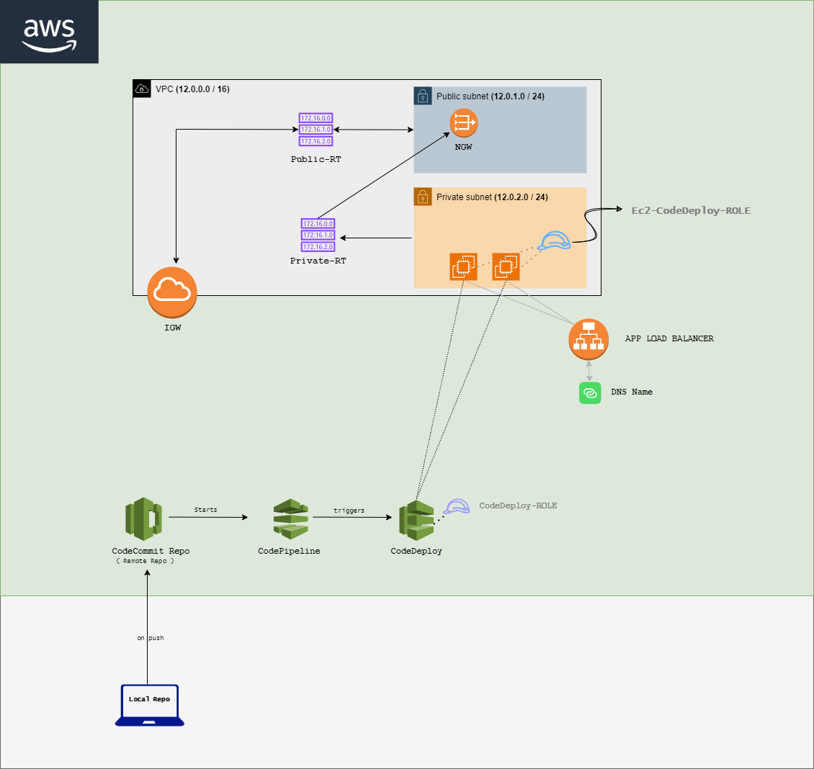

# AWS CICD + EC2 Instance + NGINX + LB

## Architecture 

# Steps 

### Uploading Code 

- clone this repo

- Navigate to the `simple-static-site-001` folder

        cd simple-static-site-001

- Create a Repository using AWS CLI (⚠️ configure aws user and git credentials )
        
        aws codecommit create-repository --repository-name simple-static-site-001

- Setup Git 

        git config --global credential.helper '!aws codecommit credential-helper $@'

        git config --global credential.UseHttpPath true

-  Create a IAM User and generate Credentials for Code commit. Make sure to give Necessay CodeCommit Access (`AWSCodeCommitPowerUser`) using policy to the User

- Set your CC repo as Remote Origin (⚠️ configure aws user and git credentials )
        
        git init 

        git remote add origin https://git-codecommit.<region>.amazonaws.com/v1/repos/simple-static-site-001

- Push the Code to the Repo

        git add .

        git commit -m "first Commit"

        git push -u origin master

- This will Prompt for your Code Commit Credntials , so paste your Credentials in the Popup Dialog Box

## Creating Roles for Necessary Permissions

### For EC2 
- Create a Role 
- Choose the Service as Ec2
- Search for `AmazonEC2RoleforAWSCodeDeploy` and attach this policy to this role
- name it as `Ec2-CodeDeploy`
- Save it

### For CodeDeploy

- Create a Role
- Choose the Service as `CodeDeploy`
- Simply choose CodeDeploy Radio Button
- Click Next and Create (dont attach any additional policy other than the recommended one)
- name it as `CodeDeploy-ROLE`
- Save it

# Creating a Infrastructure

Sample tutorial : [Click here](https://youtu.be/ydxEeVAqVdo)

- A VPC (10.0.0.0/16)

    Two Subnets 
    - Public-1A (10.0.1.0/16)
    - Private-1A (10.0.2.0/16)
- An Internet Gateway

- A NAT Gateway (Associate it with Public-1A)

    Two Route Tables
    - Public-RT (To connect to IGW)
    - Private-RT (To route local Traffic & NGW)

- Security Group allowing SSH & HTTP Access to the Private instance

- A Bastion Host (Instance on Public Subnet) to conect to our Private Instance [or] Use Systems manager to access the private Instance

### Create a New Al23 Ec2 instances

- Add an Additional Tag called `'grp' : 'sss'` (you can give ur preferred custom tag to identify the resources)

- Choose AL2023 AMI

- Choose the Private Subnet of Your VPC to deploy this

- Configure the Security Group to Allow HTTP (80) web Traffic 

- Go To Advance Details

- Choose IAM Profile `Ec2-CodeDeploy` (we created Earlier)

- Use this user_data

        #!/bin/bash
        sudo dnf -y update
        sudo dnf -y install ruby wget nginx
        cd /home/ec2-user
        wget https://aws-codedeploy-ap-south-1.s3.ap-south-1.amazonaws.com/latest/install
        sudo chmod +x ./install
        sudo ./install auto
        sudo dnf install -y python3-pip
        sudo pip3 install awscli
        sudo systemctl start nginx

- Create It 

- Name it as `Server-SSS-001-a`

- Create Two or More Instances for Load balancing

Note : It will take Few Minutes to Install All these things

### Create a target Group

- Create a New Target group Named `sss-001-TG`

- Add all the instances which you have  you have given custom tags `'grp' : 'sss'` to this Target Group

- Change the Health check configurations if needed.

### Create a App Load Balancer 

- Create a New **Applicaion Load Balancer** named `sss-001-LB`
- Use the `Port : 80` (we r using a web app)
- select the target group which we have created previously `sss-001-TG`
- 

### Setting the Deployment

- navigate to Deploy Section in your Console

- Create a new Deploment named `sss-001-Deploment`

- Choosle `Ec2/On-premise` as Compute Platform
  
- Now create the **Deployment Group**

- name it as `sss-001-DG`

- under Environment Configurations choose `Amazon EC2 instances`

- Add the Instance Group TAG for the deployment (`'grp' : 'sss'`) This will help us to select all the instances Which we want to use for CICD

- Enable the Load Balancing & choose the Same Target grp which we have created and assigned to the Load Balancer `sss-001-TG`

- Choose Deployment configuration As Per Your Need

- Create the Deployment

### Setting the Pipeline

- Navigate to CodePipeline in your Console

- Create a New Pipeline named `SSS-001-PL`

- Allow it to create a New Service role

- Choose AWS Code commit as Source and Choose Your Repo

- Skip the Build stage (our pipeline doesn't need it)

- Choose Deploy Provider as CodeDeploy and Choose your Deployment APP name (`sss-001-Deploment`) and Deployment Group `sss-001-DG`

### Testing
- Now try to push a commit.

        git add .

        git commit -m "first Commit"

        git push -u origin master

- your pipeline will get exceuted and deployment will get deployed to the spcified instances aand you can visit the chnages with the Load Balancer's URL.

## Resource & Tutorials Referred :

- https://youtu.be/531i-n5FMRY
- https://github.com/aarhemareddy/aws_cicd_pipline_codedeploy/tree/main
- https://youtu.be/ydxEeVAqVdo

